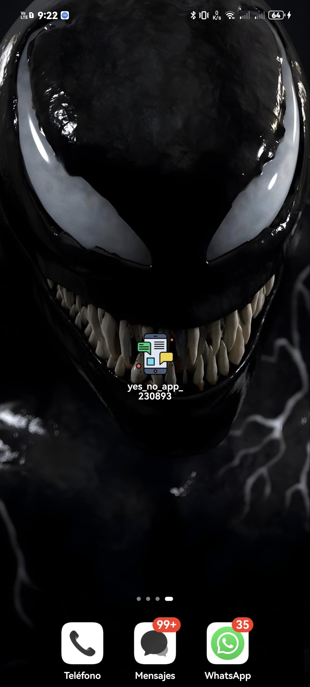
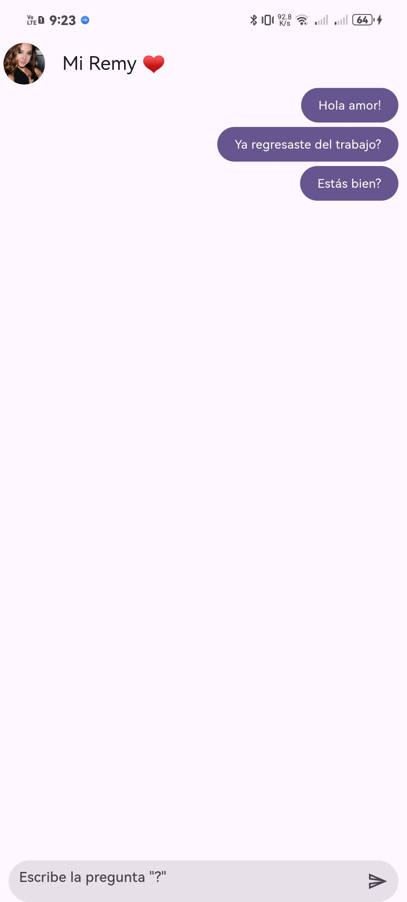
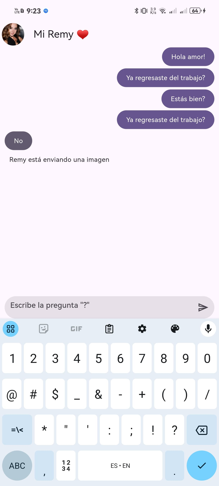
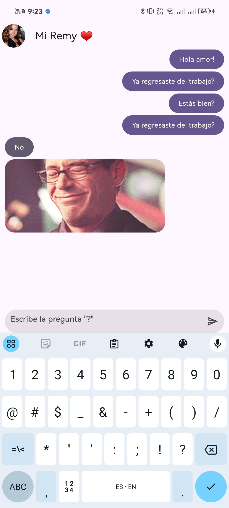
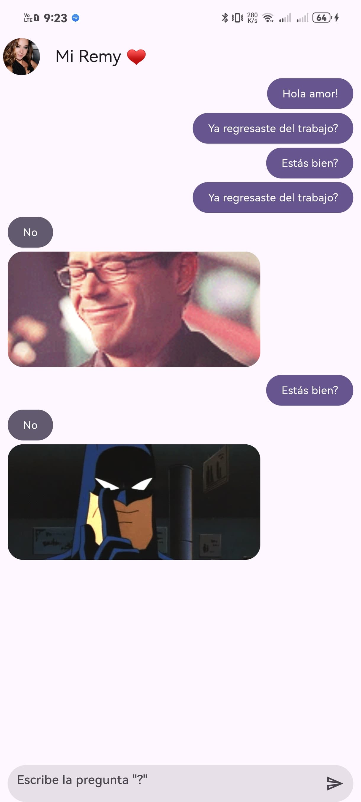

# DMI-10A-Yes-No-App-Flutter-230893
BrayanG02/DMI-10A-Yes-No-App-Flutter-230893

---

**DESCRIPCIÓN**
PROYECTO DE CLASE PARA LA UNIDAD 2 DE LA ASIGNATURA DE DESARROLLO MOVIL INTEGRAL (DMI) IMPARTIDA POR EL M.T.I MARCO A. RAMIREZ HERNANDEZ

### HISTORIAL DE PRACTICAS
|NO.|NOMBRE|POTENCIADOR|ESTATUS|
|--|--|--|--|
|22|CONSTRUCCIÓN DE LA UI DEL CHAT|POR DEFINIR|⭐ACTIVA|
|23|IMPLEMENTACIÓN DE LA FUNCIONALIDAD DEL CHAT|POR DEFINIR|⭐ACTIVA|

### LISTA DE HERRAMIENTAS

## Herramientas Utilizadas
- **Dart**: Lenguaje de programación utilizado para desarrollar aplicaciones Flutter.
- **Flutter**: Framework para crear aplicaciones nativas de forma rápida.

### AUTOR
ELABORADO POR BRAYAN GUTIERREZ RAMIREZ [@BrayanG02](https://github.com/BrayanG02)

    
    

     

| **Nombre del estudiante** | Brayan Gutiérrez Ramírez |
|:-------------------------:|:------------------------------:|
| **Matrícula**             | 230893                         |
| **Carrera**               | Ingeniería en Desarrollo y Gestión de Software |

# PRACTICA 21: YES NO APP FLUTTER

## OBJETIVO DEL PROYECTO:
Diseñar y desarrollar una plataforma de chat interactivo que ofrezca respuestas automáticas en formato "Sí" o "No" y, de manera complementaria, envíe un GIF relacionado con la respuesta proporcionada. Esto busca mejorar la experiencia del usuario al combinar simplicidad en la interacción con un componente visual atractivo y lúdico.

## DESCRIPCIÓN:
El proyecto consiste en un sistema de chat interactivo que permite a los usuarios realizar preguntas o plantear situaciones específicas, obteniendo como respuesta únicamente "Sí" o "No". Para enriquecer la interacción, el sistema adjunta un GIF relacionado con la respuesta, aportando un toque de humor, contexto o dinamismo visual.

Este chat está diseñado para ser intuitivo y directo, enfocándose en una experiencia minimalista pero entretenida. Es ideal para usuarios que buscan resolver dudas rápidas, tomar decisiones simples o disfrutar de un momento de entretenimiento visual en sus conversaciones.

El sistema utiliza una base de datos de GIFs previamente categorizados según las respuestas y cuenta con lógica de decisión para seleccionar y enviar el GIF más adecuado a la interacción del usuario.

# RESULTADO DE LA PRÁCTICA
| Imagen 1               | Imagen 2               | Imagen 3               |
|------------------------|------------------------|------------------------|
|  |  |  |
| Imagen 4               | Imagen 5               ||
|  |  | 